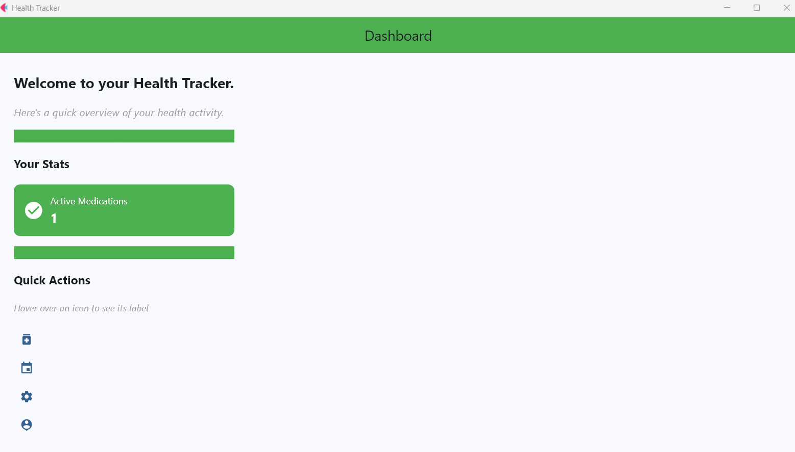
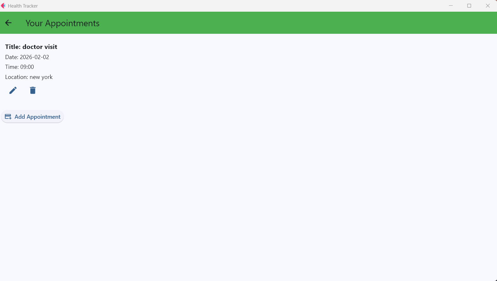
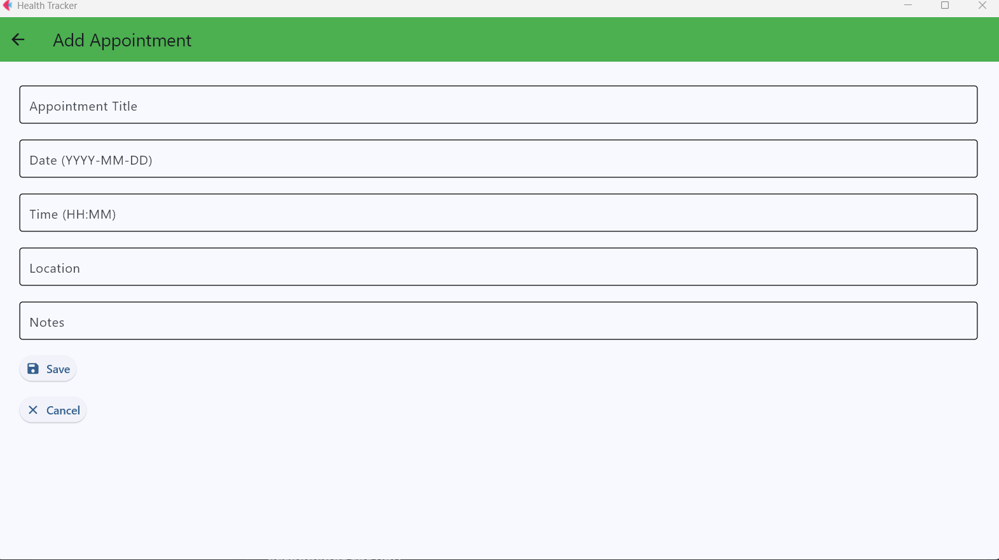
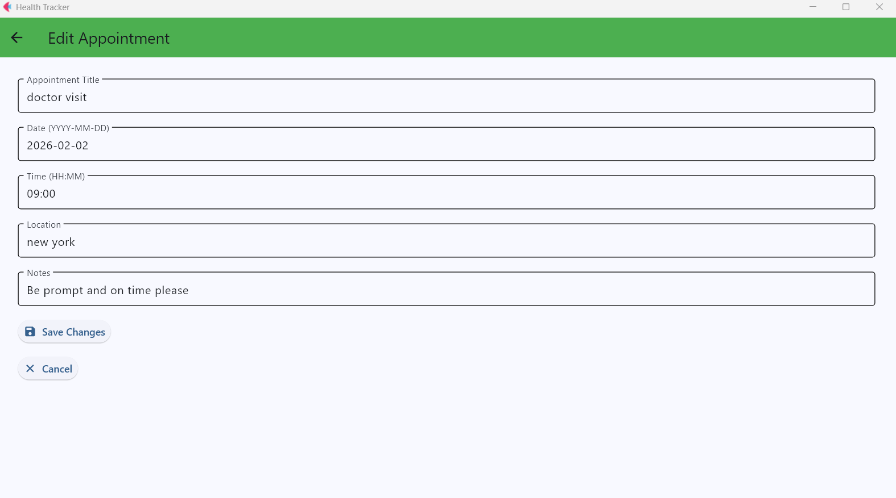
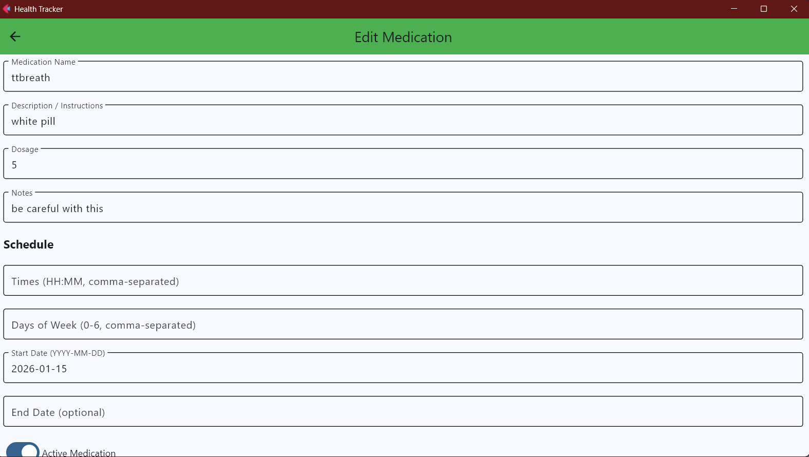
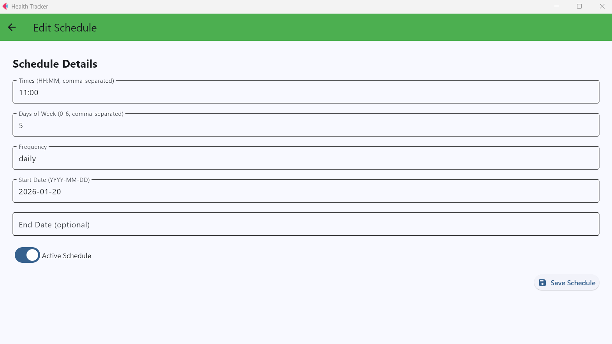
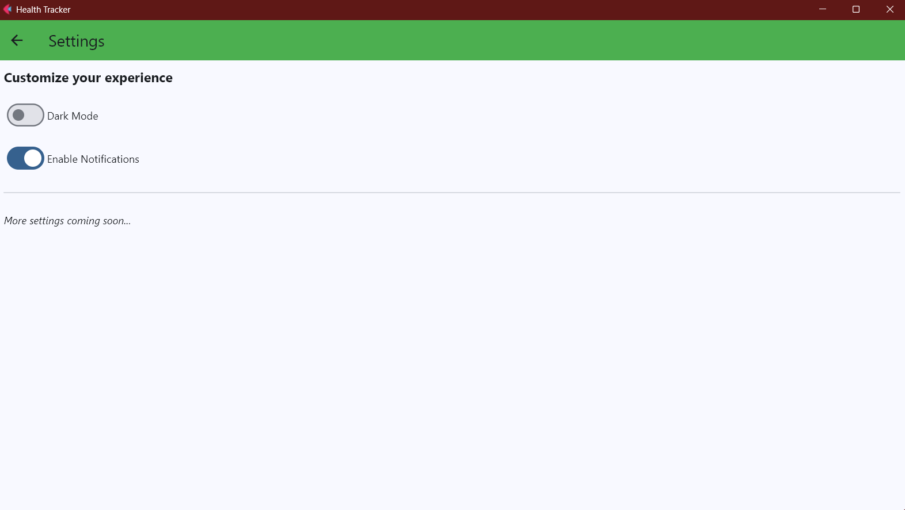
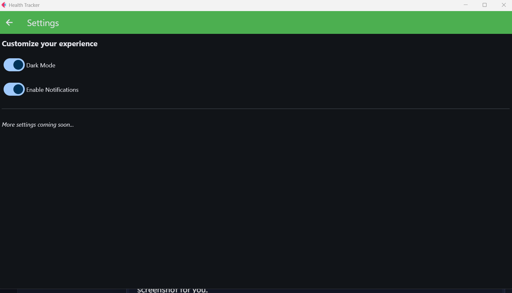
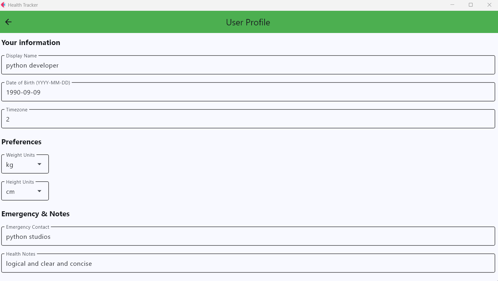
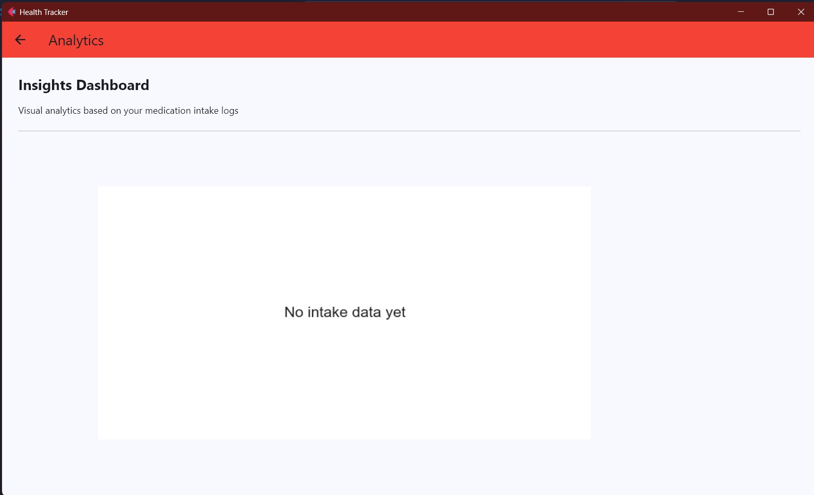

# Health Tracker App


A modern, modular health‑tracking application built with Python and Flet.  
It’s designed to manage medications, reminders, schedules, appointments, and user health data.  
The architecture follows a clean separation of concerns with repositories, validators, services, and a background scheduler.

---

# ⭐ Features

## 💊 Medication Management
- Add, edit, and view medications  
- Dosage tracking  
- Notes and status indicators  

## ⏰ Scheduling and Reminders
- Daily and weekly schedules  
- Custom reminder offsets  
- Automated reminder event generation  
- Background scheduler thread  
- UI notifications via Flet’s SnackBars  

## 📅 Appointments
- Create and manage appointments  
- Notes, location, date, and time  

## 📈 Intake Logs
- Track when medication was taken  
- Validation to ensure data integrity  

## 👤 User Profile
- Basic user information  
- Editable profile screen  

## ⚙️ Settings
- Toggle notifications  
- App preferences  

---

# 📸 Screenshots

## Dashboard


## Appointments


## Add Appointment


## Edit Appointment


## Medications


## Schedules


## Settings


## Dark Mode


## User Profile


## Analytics Dashboard



---

# 🧱 Architecture Overview

The project is structured into clear, maintainable layers.

## 🎨 UI Layer (Flet Views)
- Screens for medications, appointments, schedules, dashboard, settings, and more  

## 📦 TypedPage
- A custom subclass of `ft.Page` that acts as a dependency container  

## 🗄 Repositories
- Handle all database interactions  

## 🛡 Validators
- Ensure data integrity before saving  

## 🔧 Services
- Business logic for schedules, reminders, notifications, and intake logs  

## 🧮 ScheduleEngine
- Expands schedules into actual datetime events  

## 🕒 SchedulerService
- Background thread that checks for due reminders every minute  

---

# 📂 Project Structure

```
health_app/
│
├── data/
├── models/
├── screens/
├── services/
├── validators/
├── ui_types/
├── main.py
└── README.md
```


---

# 🚀 Installation

## 1. Clone the repository

```bash
git clone https://github.com/reory/Health-Tracker-App.git
python -m venv venv
venv\Scripts\activate
pip install -r requirements.txt
python main.py
```
---

# 🗺 Roadmap

Planned enhancements and future improvements:

- [ ] Add medication refill reminders  
- [ ] Add data export/import (JSON or CSV)  
- [ ] Add charts for intake history  
- [ ] Add cloud sync or optional online backup  
- [ ] Add multi‑user profiles  
- [ ] Add theme customisation (colour palettes)  
- [ ] Add optional biometric lock (Windows Hello / Touch ID)  


🧪 Test File
A stripped‑down test file (test.py) is included for isolating UI behaviour.

🤝 Contributions
Contributions are welcome as always.

👤 Author — Roy Peters
Enjoy architecting clean, maintainable Python applications with clarity and purpose for everyone.

